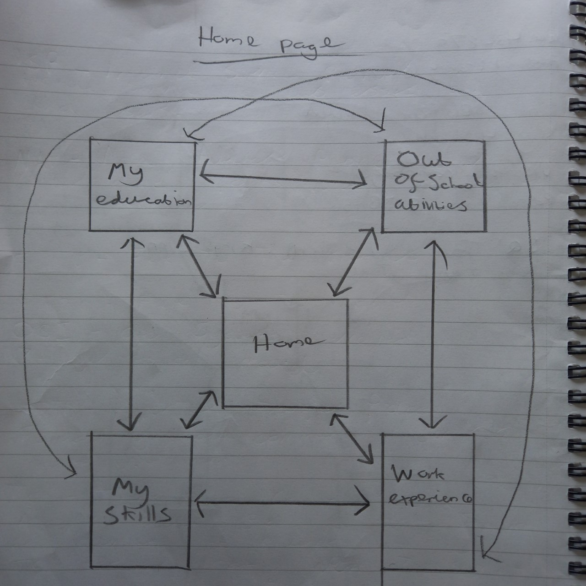
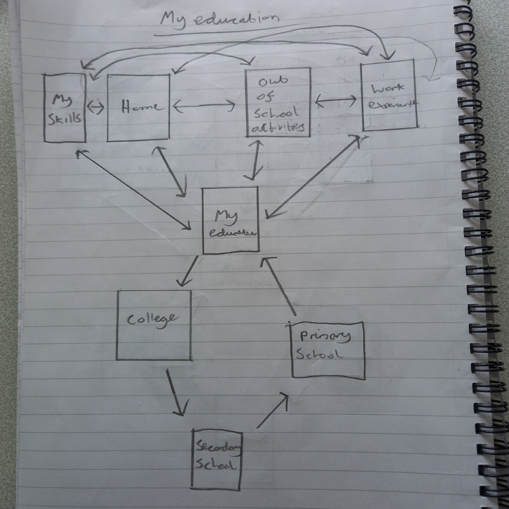
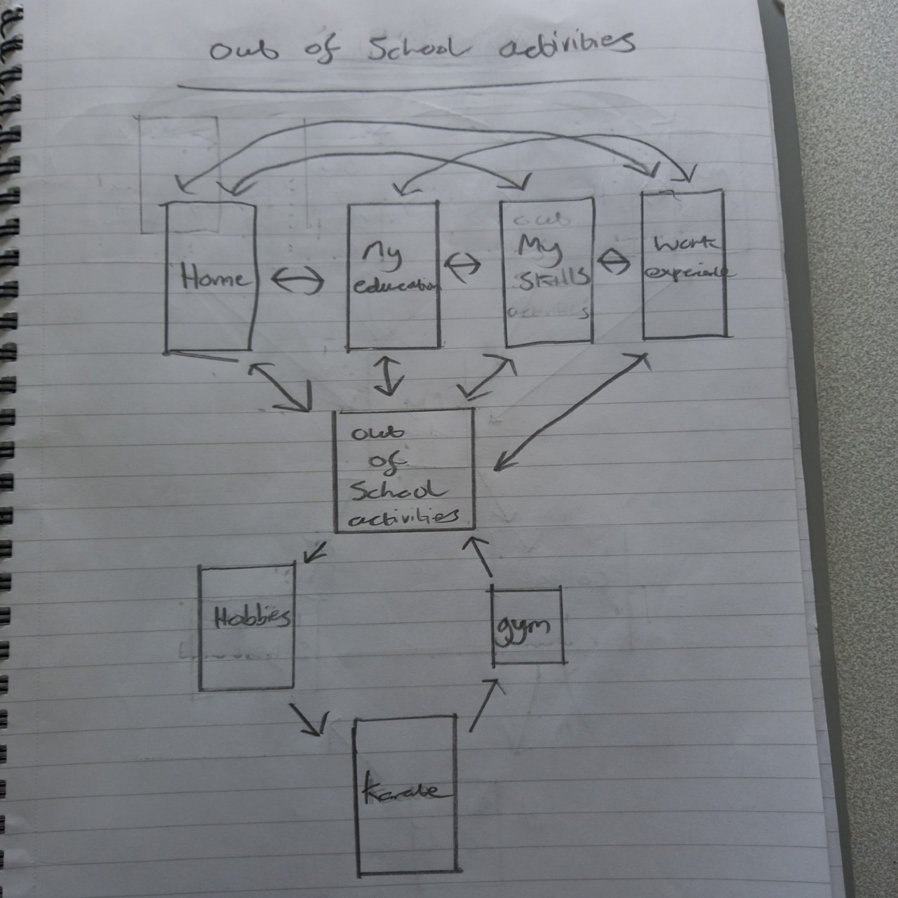
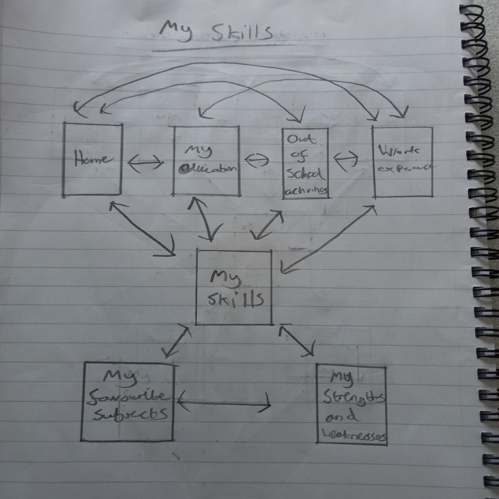
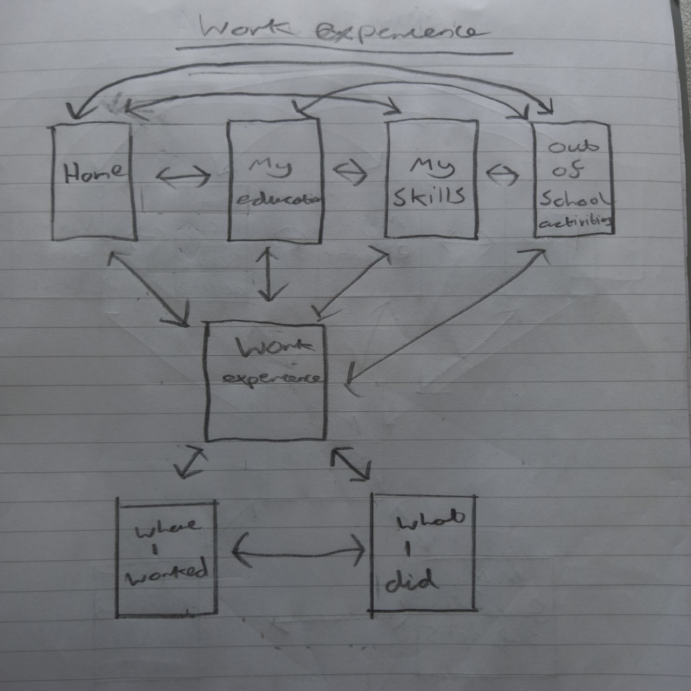

# Navigation

These are the maps of the navigation system from each of my main pages in the digital nportfolio. I will also be including a go to table and description for each of them.

## Home page

|   | Home  | My education  | Out of school  | My Skills  | Work experience
|---|---|---|---|---|---|
| Home  |&#x2611; | &#x2611; | &#x2611;  | &#x2611;  | &#x2611;
| My education  | &#x2611;  | &#x2611;  |  &#x2611; | &#x2611;  | &#x2611;
| Out of school  | &#x2611;  | &#x2611;  |  &#x2611; | &#x2611;  | &#x2611;
| My skills| &#x2611; | &#x2611; | &#x2611; | &#x2611; | &#x2611;
| Work experience | &#x2611; | &#x2611; | &#x2611; | &#x2611; | &#x2611;

## My education page

|   | My education  | College  | Secondary school  | Primary school  | 
|---|---|---|---|---|
| My education  | &#x2611;  | &#x2611;  |  &#x2612; | &#x2612;  |
| College  | &#x2612;  | &#x2611;  | &#x2611;  | &#x2612;  |
| Secondary school  | &#x2612;  | &#x2612;  | &#x2611;  | &#x2611;  |
| Primary school | &#x2611; | &#x2612; | &#x2612; | &#x2611;|

## Out of school activities page

|   | Out of school  | Hobbies  | Karate  | Gym  | 
|---|---|---|---|---|
| Out of school  | &#x2611;  | &#x2611;  |  &#x2612; | &#x2612;  |
| Hobbies | &#x2612;  | &#x2611;  | &#x2611;  | &#x2612;  |
| Karate  | &#x2612;  | &#x2612;  | &#x2611;  | &#x2611;  |
| Gym | &#x2611; | &#x2612; | &#x2612; | &#x2611;|

## My skills page

|   | My skills  | Favourite subjects  | Strengths and weaknesses  |   
|---|---|---|---|
| My skills  | &#x2611;   | &#x2611;   | &#x2611;   |  
| Favourite Subjects  | &#x2611;   | &#x2611;   | &#x2611;   |  
| Strengths and weaknesses  | &#x2611;   | &#x2611;   | &#x2611;   |  

## Work experience page

|   | Work experience  | Where I worked | What I did  |   
|---|---|---|---|
| Work experience  | &#x2611;   | &#x2611;   | &#x2611;   |  
| Where I worked  | &#x2611;   | &#x2611;   | &#x2611;   |  
| What I did  | &#x2611;   | &#x2611;   | &#x2611;   |  

## Summary

In summary, the navigation system is quite consistent throughout all pages of the portfolio except for the slight changes for the navigation of the sub pages. The navigation for the 'My education' and 'Out of school activities' sub pages are the same and the navigation for the 'My skills' and 'Work experience' sub pages are the exact same, those are the only differences, the five main web pages are all connected together.