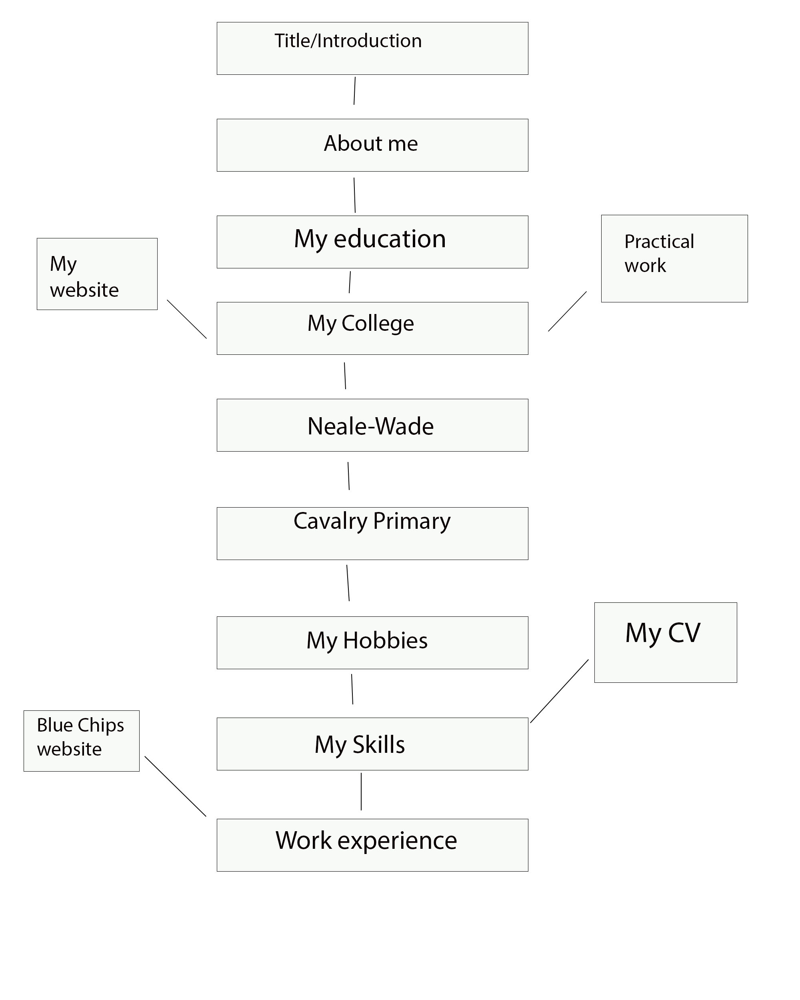

# Navigation

## Evaluation 

Since I am going to be making this digital portfolio on microsoft sway the navigation will be much more simple than something like a website since a sway presentation is simply just a scroll down. However, there will be different sections of this portfolio so I will be showing the order that they go in.

## Navigation image

## Go to table

|   | Title  | About me  | My education  | My College  | Practical Work | My website | Neale-Wade | Cavalry Primary | My Hobbies | My Skills | My CV | Work experience | Blue Chip website |
|---|---|---|---|---|---|---|---|---|--|---|---|---|---|
| Title  | &#x2611;  | &#x2611;  | &#x2611;  | &#x2611;  | &#x2612; | &#x2612; | &#x2611; | &#x2611; | &#x2611;| &#x2611; | &#x2612; | &#x2611; | &#x2612; |         
| About me  | &#x2611;  | &#x2611;  | &#x2611;  | &#x2611;  | &#x2612; | &#x2612; | &#x2611; | &#x2611; | &#x2611;| &#x2611; | &#x2612; | &#x2611; | &#x2612; |         
| My education  | &#x2611;  | &#x2611;  | &#x2611;  | &#x2611;  | &#x2612; | &#x2612; | &#x2611; | &#x2611; | &#x2611;| &#x2611; | &#x2612; | &#x2611; | &#x2612; |         
| My College | &#x2611;  | &#x2611;  | &#x2611;  | &#x2611;  | &#x2611; | &#x2611; | &#x2611; | &#x2611; | &#x2611;| &#x2611; | &#x2612; | &#x2611; | &#x2612; |         
| Practical Work | &#x2612;  | &#x2612;  | &#x2612;  | &#x2611;  | &#x2611; | &#x2612; | &#x2612; | &#x2612; | &#x2612;| &#x2612; | &#x2612; | &#x2612; | &#x2612; |         
| My website | &#x2612;  | &#x2612;  | &#x2612;  | &#x2611;  | &#x2612; | &#x2611; | &#x2612; | &#x2612; | &#x2612;| &#x2612; | &#x2612; | &#x2612; | &#x2612; |         
| Neale-Wade | &#x2611;  | &#x2611;  | &#x2611;  | &#x2611;  | &#x2612; | &#x2612; | &#x2611; | &#x2611; | &#x2611;| &#x2611; | &#x2612; | &#x2611; | &#x2612; |         
| Cavalry Primary | &#x2611;  | &#x2611;  | &#x2611;  | &#x2611;  | &#x2612; | &#x2612; | &#x2611; | &#x2611; | &#x2611;| &#x2611; | &#x2612; | &#x2611; | &#x2612; |         
| My Hobbies | &#x2611;  | &#x2611;  | &#x2611;  | &#x2611;  | &#x2612; | &#x2612; | &#x2611; | &#x2611; | &#x2611;| &#x2611; | &#x2612; | &#x2611; | &#x2612; |         
| My Skills | &#x2611;  | &#x2611;  | &#x2611;  | &#x2611;  | &#x2612; | &#x2612; | &#x2611; | &#x2611; | &#x2611;| &#x2611; | &#x2611; | &#x2611; | &#x2612; |         
| My CV | &#x2612;  | &#x2612;  | &#x2612;  | &#x2612;  | &#x2612; | &#x2612; | &#x2612; | &#x2612; | &#x2612;| &#x2611; | &#x2611; | &#x2612; | &#x2612; 
| Work experience |  &#x2611;  | &#x2611;  | &#x2611;  | &#x2611;  | &#x2612; | &#x2612; | &#x2611; | &#x2611; | &#x2611;| &#x2611; | &#x2612; | &#x2611; | &#x2611; |         
| Blue Chip website |  &#x2612;  | &#x2612;  | &#x2612;  | &#x2612;  | &#x2612; | &#x2612; | &#x2612; | &#x2612; | &#x2612;| &#x2612; | &#x2612; | &#x2611; | &#x2611; 

## Navigation description

Firstly, the nine sections in the middle of the navigation map are the main sections that make up the digital portfolio. Each one of them are connected since they are all in one sway presentation, no matter which section you are on you can access any other section at any time.

The sections that are on the sides of the navigation map (My CV, Practical work, My website and Blue Chips website) are accessible through links that are only included in the section that they are connected to on the naviagtion map, for example the link to Blue Chips website is only accessible in the 'Work experience' section on the digital portfolio. They are not connected to any of the other sections as seen on the navigation map since the links to them aren't available on the other sections.

I chose this navigation structure because it is basic and straightfoward which is important when it comes to a portfolio since all employers want is a portfolio that very clearly represents you, so making the navigation simple will save them time having to scavenge through my portfolio in order to find information that may interest them. Another reason why simple navigation is great for a portfolio, it can tell employers that you like to keep everything organised to make things much easier on yourself and anyone else which is also useful when it comes to working in a job, especially an IT related one. 

