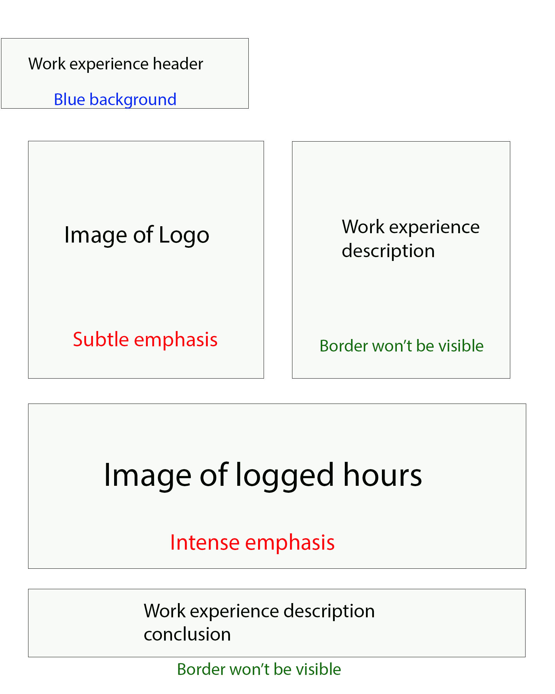

# Portfolio storyboards

## Title and about me section

This will be the layout for the start of the portfolio and it will contain the title, my name a section that is a description of me. I chose this layout because I believed that having a little personal profile at the start was a great idea since it introduces anyone who is viewing this portfolio to me who is the person that the portfolio is going to be based on. The conatiner that is holding the title and my name will have its own background just for decoration, it will be an image of the college of west anglia becuase it is apart of my educational experience. The title, my name and all of the headers will have blue backgrounds since it is one of the colours within my chosen colour scheme. The background for all of thye sections will be white because the colour for most of the text will be black, so it was ideal to have a bright background so that the black text was more visible, I did acknowledge that mixing certain colours together can make the text less vsisble and harder to read plus some people may have difficulties in reading certain coloured text so I just chose two colours that mix well which was black and white. 

The image will be an image of me for my personal profile and the about me description will be providing an introduction me, my name, what college I go to and some things I do in my free time etc. I will give the image a subtle emphasis which is the smallest size setting for images on microsoft sway, I chose this size because it prevents the image from being distorted whilst not being too small up to the point it is barely visible.

## My eductaion section

This section is an introduction of my education experience in three schools I went to and the next three sections will go into more detail. Since this an introduction there isn't much to this page. There is the header at the top which will have that blue background like all of the other headers within this portfolio. There is text underneath that which is the introduction of my educational experience and it identifies all three of the schools that I went to which is Cavalry Primary, Neale-Wade Academy and College of West Anglia. Then underneath that is a slide show of three images, each image is an establishing shot of the buildings of the three schools.

I though that this layout for this section is appropriate because this section is only an introduction to three other sections which contain more detail. So in conclusion this section won't require a vast amount of features and components when it is only an introduction with a slide show.

## My college section

This is one of the three sections that is apart of the 'My education' section. This section goes over some of my college experiences and it is one of the longer sections since it contains some of the work I completed in my computing course. It has two groups of text with one of them explaining my work on hardware management and one explaining my unit 13 which is the website development coursework. Each one has four images which are used as evidence to show that I have done these tasks and to prove that I have decent knowledege on these topics. I believed that this is a great layout for this section because contains all of this content into an organised and tidy layout which is crutial because the portfolio is mainly used to gain employers attention and having a professional layout is something that indicates that you put effort into it.

## Neale-Wade section

This section is the second of the three sections within the 'my education' section which explains my time in Neale-Wade Academy. The main attraction of this section is the topic of my GCSE results which is something that employers look for, so it is important to showcase them. Underneath the image of my GCSE results is an explanation for why media studies was my favourite chosen subject, this will give context to employers of what type of subjects interest me and how they ineterest me. The first reason this is my chosen layout for this section is because the image is at an appropriate size because it makes the results on it much more easily readable. 

## Cavalry Primary section

## My Hobbies section

## My Skills section

## Work experience section

# Alternative storyboards

These are some alternative ideas that I had when it came to making the storyboards for my digital portfolio, I obviously ended up choosing the other designs for the portfolio. Some of the storyboards may not have an alternatives because I didn't have any other possible ideal layouts for them meaning that the layout I chose for them already convinced me that they are the one I will go with. 

## My education section

In this alternate design the three images of the schools that I went to are not in a slide show but are in a group with one of the images being a moderate size and the other two being a rather small size. Another difference between this layout and the original is the introduction being underneath the three images instead of coming before them. The reasons I chose the other layout over this one is because the three images may not appear in decent quality when they have the subtle emphasis setting, having the two bottom images this small size might make them difficult to see since the images are meant to be moderately large, also having them all a moderate size in a slide show not only makes the content on them more visible but it also saves some space.

I believe that the original design having the introduction above the images is better because it contains an explanation for what the images are and what they mean and it just gives people an explanation of the content to come before they see it whereas in this version it explains the images purpose after. In conclusion, having the introduction above the images does a better job at identifying what they are meant for so that anyone will know their purpose for when they see the images. 

## My College section

In this alternate design for the 'My College' section the only differenes beteen this and the original storyboard is the images of my course work and practicals are in slide shows that are at a moderate size. I chose the original storyboard over thsi one because some of the images have a small width so having them on a moderate sized slide show which could make them look stretched out. Whereas, having them in organised layout will allow sway to place them in their own sizes making them easier to see. One example for one of the images that have a short width is the opening view of the mobile version of my website, since it is made to be compatible with a phone it will have a similar size to a phone which means it will have a short width.

## Work experience section

This alternate version of the 'Work Experience' section has the image of the Blue Chip logo at the largest size setting with the description being underneath instead of being on the right of the logo. The screenshot of my logged work hours are at the smallest size setting instead of being at the largest like the original design, the description is also on the left of the image instead of being placed underneath it. I ended up choosing the original storyboard over this one because it is mainly to do with the image sizes. The image of the Blue Chip logo is actually not meant to be a large image which means having it a this size will make the image have seem distorted. The logged hours image has the opposite problem, the screenshot is meant to be a large image due to its long width, so having this image compressed to a small size on this design will make the content on the image barely readable. 

