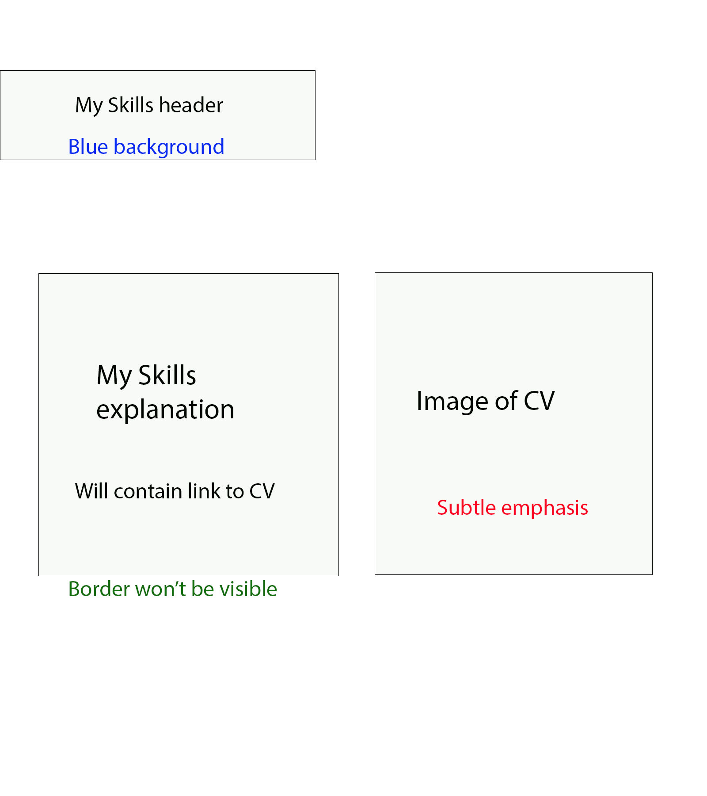
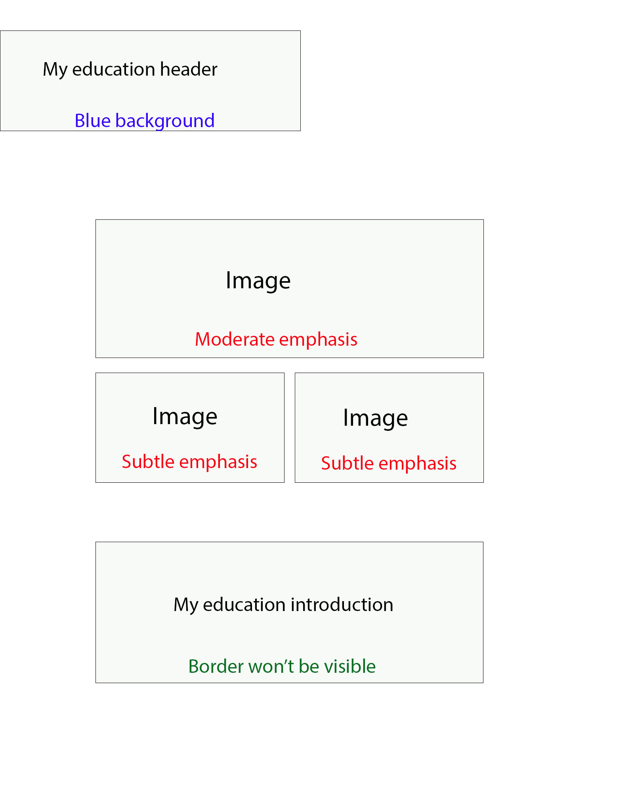

# Portfolio storyboards 

## Title and about me section 

 

This will be the layout for the start of the portfolio, and it will contain the title, my name a section that is a description of me. I chose this layout because I believed that having a little personal profile at the start was a great idea since it introduces anyone who is viewing this portfolio to me who is the person that the portfolio is going to be based on. The container that holds the title and my name will have its own background just for decoration, it will be an image of the college of west Anglia because it is a part of my educational experience.  

The title, my name and all the headers will have a blue background since it is one of the colors within my chosen color scheme. The background for all the sections will be white because the color for most of the text will be black, so it was ideal to have a bright background so that the black text was more visible, I did acknowledge that mixing certain colors together can make the text less visible and harder to read plus some people may have difficulties in reading certain colored text so I just chose two colors that mix well which was black and white.  

The image will be an image of me for my personal profile and the about me description will be providing an introduction me, my name, what college I go to and some things I do in my free time etc. I will give the image a subtle emphasis which is the smallest size setting for images on Microsoft sway, moderate is the medium sized setting and intense is the largest. I chose subtle because this size prevents the image from being distorted since the image itself is quite small (450 x 450). 

I believe that the content shown within this storyboard will be successful at meeting the audiences needs because including a personal profile in a portfolio is an indication that the person who made the portfolio clearly put some thought into it and they like to put effort into the work they produce, this can then lead to a potential employer being convinced that I am interested in getting an IT job. The background image I have chosen for the title and name container (which I have explained on my asset table plan) I belive is very professional and also mixes well with the blue background of the name and title.  

## My education section 

 

This section is an introduction of my education experience in three schools I went to, and the next three sections will go into more detail. Since this introduction there is not much to this page. There is the header at the top which will have that blue background like all the other headers within this portfolio. There is text underneath that which is the introduction of my educational experience, and it identifies all three of the schools that I went to which is Cavalry Primary, Neale-Wade Academy and College of West Anglia. Then underneath that is a slide show of three images, each image is an establishing shot of the buildings of the three schools. 

This layout for this section is appropriate because this section is only an introduction to three other sections which contain more detail. So, in conclusion this section will not require a vast number of features and components when it is only an introduction with a slide show. The colors scheme will be used the same way as it was used on the title section, the rest of the sections in the portfolio will have the color scheme used the same way.  

I feel as if this layout is successful at meeting the audience's needs because it provides them with a simple introduction to three other sections that provide a detailed description of the three schools that I have been to. In summary, it gives them some context and identifies what is going to be explained to grab their attention into reading the three next sections.  

## My college section 

 

This is one of the three sections that is a part of the 'My education' section. This section goes over some of my college experiences, and it is one of the longer sections since it contains some of the work I completed in my computing course. It has two groups of text with one of them explaining my work on hardware management and one explaining my unit 13 which is the website development coursework. Each one has four images which are used as evidence to show that I have done these tasks and to prove that I have decent knowledge on these topics.  

I believe that this is a great layout for this section and meeting the audiences needs because it contains all this content into an organized and tidy layout which is crucial because the portfolio is used to gain employers attention and having a professional layout is something that indicates that you put effort into it. 

## Neale-Wade section 

 

This section is the second of the three sections within the 'my education' section which explains my time at Neale-Wade Academy. The main attraction of this section is the topic of my GCSE results which is something that employers look for, so it is important to showcase them. Underneath the image of my GCSE results is an explanation for why media studies were my favorite chosen subject, this will give context to employers of what type of subjects interest me and how they interest me.  

The reason this is my chosen layout for this section is because the image is at an appropriate size because it makes the results on it much more easily readable. This storyboard will meet the audience's needs because I am providing them with a clear showcase of valuable information such as my final GCSE grades in Neale-Wade. 

## Cavalry Primary section 

 

This section is the third of the three sections within the 'My Education' section. This section goes over my experience in Cavalry Primary and this layout is relatively small mainly because it is one of the sections with the least amount of content in this digital portfolio. It only contains an explanation with an image beside it used as evidence which will have the small size setting because the actual image itself is quite small. Underneath that, there is a further explanation that goes over my favorite subject in that school and that is IT. Like the other sections in the portfolio, the colors within my chosen color scheme will be used the exact same way in this section.  

I chose this layout because it is a simple layout for a simple topic which makes it easier to find certain information that may be relevant to employers or organizations etc. The fact that I am stating that IT was my favorite subject in Primary school may catch the attention IT employers because it indicates that I am interested with the subject. 

## My Hobbies section 

 

This is another small section because there is simply not much to explain about the two main topics in this section. I will make sure to include details that will interest the audience and explain why these two hobbies are relevant and are worth paying attention to. The color scheme is used the same way as the other pages in this portfolio.  

I believe that this layout will successfully meet the audiences needs because it is extremely easy to navigate through which makes it simple to find information that they may find interesting or important, plus the evidence on the right-hand side highlights that these are my hobbies. 

## My Skills section 

 

This section has a similar layout to the previous section mainly because of the same reason, the both of them do not have much to explain but I made sure to include the important information that will catch the attention of potential employers. Like the other sections, the colors within the color scheme will be used the same way. There is just an explanation of my skills and why they are relevant and how they are my main skills. I also provided the link to my CV so that the audience can view it to gain extra information on my skills which can be valuable information to employers.  

What makes this layout able to meet the audience’s needs is the fact that it is easy to find the important information in this section since it is a remarkably simple layout that is quite simple to navigate through. The fact that I have also provided a link to the Word document of my CV will allow any employer to view extra information that may be worth paying attention to.  

## Work experience section 

 

This storyboard is the layout of the 'Work Experience' section on my digital portfolio. The first half of this layout is similar to the last two storyboards but the difference being that the image is on the left side and the information is on the right side, the description will include a link to Blue Chips website. The image will be the logo of Blue Chip Brand Solutions which is the 3D digital printing company I did my 60 hours of work experience at; the image will be given the small size setting. Underneath that is an image with the largest size setting containing a screenshot of my logged work experience hours which will be used as proof that I have done my 60 hours, underneath that image is just further information of my experience at Blue Chip Brand Solutions.  

I believe that this layout meets the audiences needs because the image of the logo and the description next to it is a fantastic way to give the audience some context onto my work experience because not only am I providing information on what they do, I am also providing their logo and website link so that the audience will know exactly what the company does and that will indicate what skills I must have learned there.  

# Alternative storyboards 

These are some of the original designs for some of the sections within my portfolio. I ended up changing these to the storyboards above as a result of the feedback received from one of my tutors Lisa Bird.  

## My education section 

 

In this alternate design the three images of the schools that I went to are not in a slide show but are in a group with one of the images being a moderate size and the other two being a rather small size. Another difference between this layout and the original is the introduction being underneath the three images instead of coming before them. The reason I chose the other layout over this one is because the three images will look much more organized on a slide show and will not take up space. The size that they appear on the slide show is better and looks less distorted than the way they would appear if this was the chosen layout.  

I believe that the other design having the introduction above the images is better because it contains an explanation for what the images are and what they mean, and it just gives people an explanation of the content to come before they see it whereas in this version it explains the images purpose after. In conclusion, having the introduction above the images does a better job at identifying what they are meant for so that anyone will know their purpose for when they see the images.  

## Received feedback  

After showing Lisa this design, we came to an agreement that the images would look much better in a slide show because it would look much more organized and professional, which is why I chose to include the slide show instead of this layout. She also pointed out that having them in a slide show showcases my skill and the fact that I have put some thought into the portfolio because I would not be using the same idea of just having them as images in the exact same layout as the ones on the other sections.  

## My College section 

 

In this alternate design for the 'My College' section the only differences between this and the other storyboard is the images of my course work and practicals are in slide shows that are of a moderate size. I chose the other storyboard over this one because some of the images have a small width so having them on a moderate sized slide show could make them look stretched out. Whereas, having them in organized layout will allow sway to place them in their own sizes making them easier to see. One example of one of the images that have a short width is the opening view of the mobile version of my website, since it is made to be compatible with a phone it will have a comparable size to a phone which means it will have a short width. 

## Received feedback 

After showing Lisa this design, she did support the idea of having these images being in a slide show, but after I pointed out they might have a better view if I just had them separated  

because when they are in a slide show the images will shrink, in this case the images are the practical and website images so having them quite small in a slide show will make it quite hard to see, she agreed with this statement, so I decided to go with having the images in the layout that is shown in the chosen 'My College' layout at the top of this page.  

## Work experience section 

 

This alternate version of the 'Work Experience' section has the image of the Blue Chip logo at the largest size setting with the description being underneath instead of being on the right of the logo. The screenshot of my logged work hours is at the smallest size setting instead of being at the largest like the original design, the description is also on the left of the image instead of being placed underneath it. I ended up choosing the other storyboard over this one because it is to do with the image sizes. The image of the Blue Chip logo is not meant to be a large image which means having it this size will make the image have seem distorted. The logged hours image has the opposite problem, the screenshot is meant to be a large image due to its long width, so having this image compressed to a small size on this design will make the content on the image barely readable.  

## Received feedback  

After showing Lisa this storyboard, she pointed out that having the image of the Blue Chip logo at the size shown on this storyboard would make it look distorted and low quality, as a result I ended up with having the logo at a small size to the left of the text where it has decent quality.  

## Feedback summary 

The other storyboards did not have original designs because Lisa agreed that they did not need improving, the layouts were already professional and suitable for this portfolio. I also believed that no changes needed to be made so I just kept these designs as they are. 

