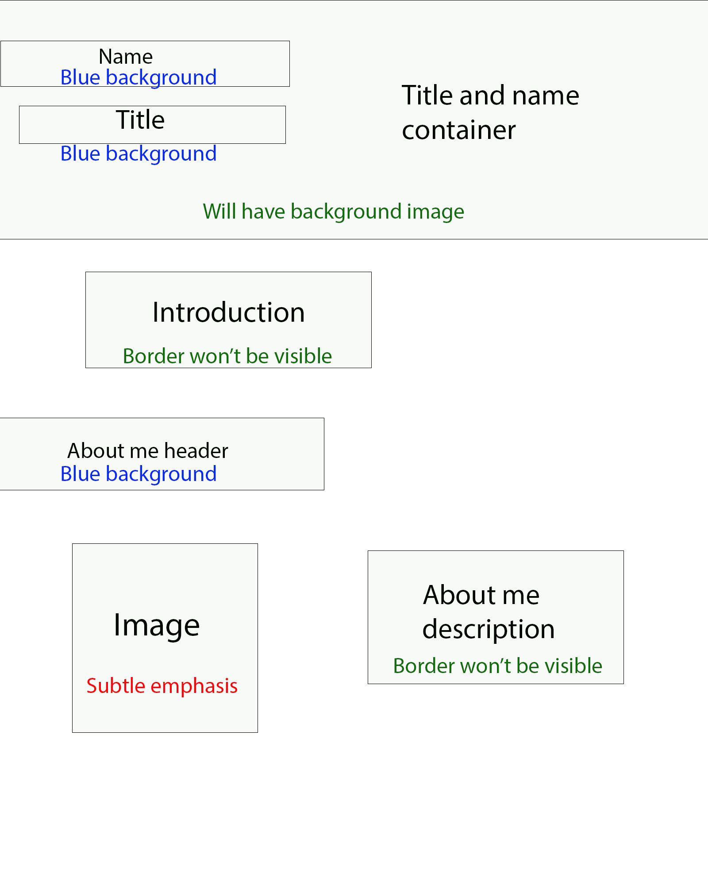
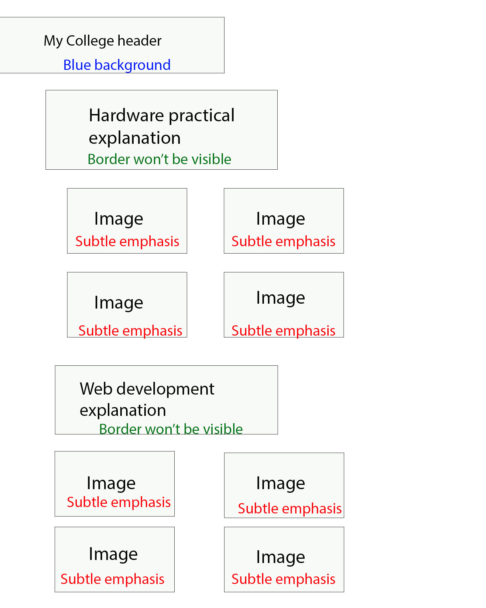
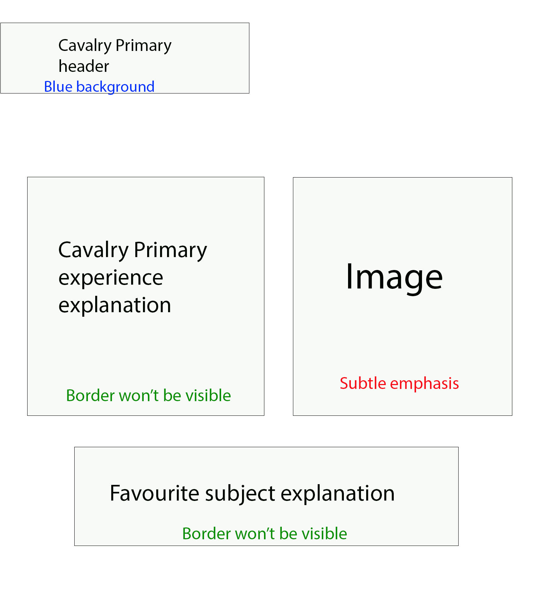

# Portfolio storyboards

## Title and about me section

This will be the layout for the start of the portfolio and it will contain the title, my name a section that is a description of me. I chose this layout because I believed that having a little personal profile at the start was a great idea since it introduces anyone who is viewing this portfolio to me who is the person that the portfolio is going to be based on. The conatiner that is holding the title and my name will have its own background just for decoration, it will be an image of the college of west anglia becuase it is apart of my educational experience. The title, my name and all of the headers will have blue backgrounds since it is one of the colours within my chosen colour scheme. The background for all of thye sections will be white because the colour for most of the text will be black, so it was ideal to have a bright background so that the black text was more visible, I did acknowledge that mixing certain colours together can make the text less vsisble and harder to read plus some people may have difficulties in reading certain coloured text so I just chose two colours that mix well which was black and white. 

The image will be an image of me for my personal profile and the about me description will be providing an introduction me, my name, what college I go to and some things I do in my free time etc. I gave the image an appropriate size because I noticed that having the image at larger sizes will make it look distorted, so I gave it a smaller size whilst not making too small so that people can see it clearly.

## My eductaion section

This section is an introduction of my education experience in three schools I went to and the next three sections will go into more detail. Since this an introduction there isn't much to this page. There is the header at the top which will have that blue background like all of the other headers within this portfolio. There is text underneath that which is the introduction of my educational experience

## My college section

## Neale-Wade section

## Cavalry Primary section

## My Hobbies section

## My Skills section

## Work experience section

