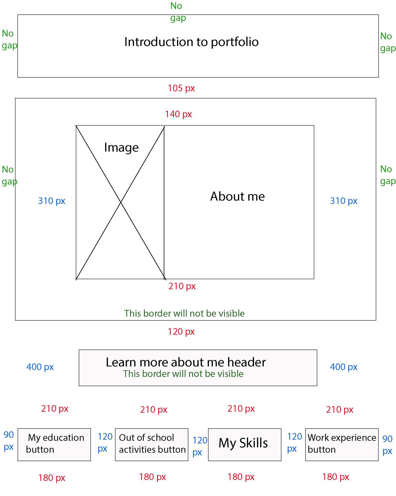
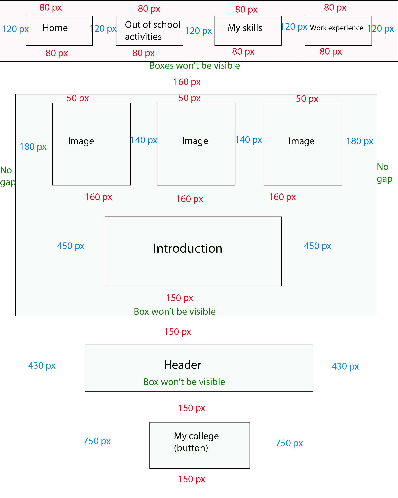
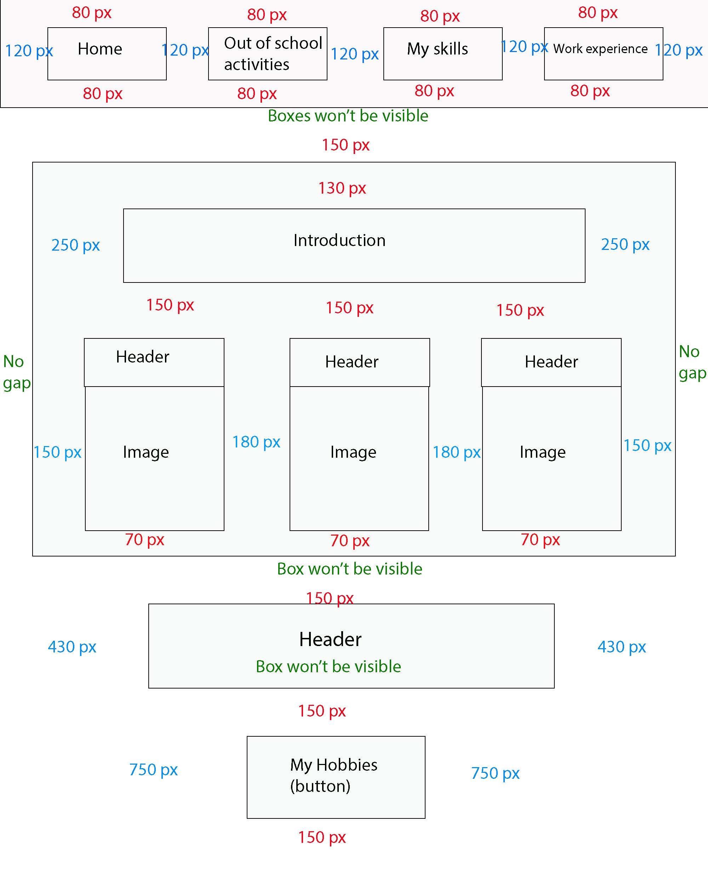
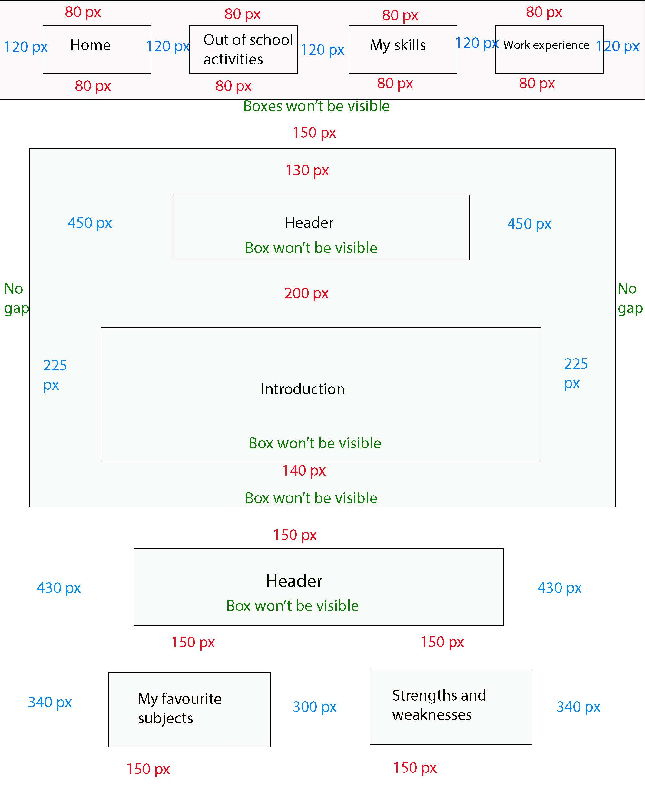
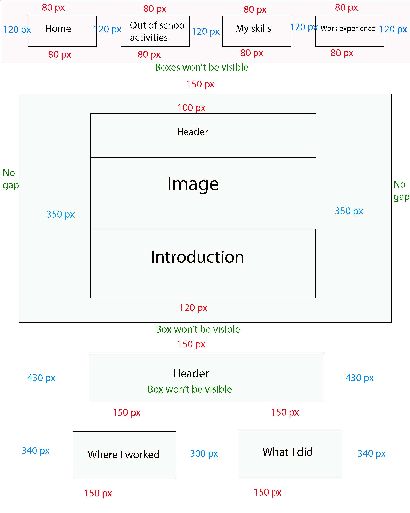

# Portfolio storyboards

These are the storyboards for each page of my digital portfolio. I will be explianing the contents within these pages and how I will be using the colours and the fonts.

# Home page/about me 

# My education page

# Out of school activities page

# My skills page

# Work experience page

# Evaluation

## Layout

For each page of this portfolio, I have made them all have a very similar layout becuase it will allow any viewer to feel familiar with the layout of each page and navigating through them. Whilst keeping the consistency for most of the layout, I have given each page a different layout to the large box in the middle containing the introduction to each topic. I did this becuase although keeping consistency, I felt that I should make at least some aspects of the pages different becuase it can feel a bit dull and boring having absolutely everything the exact same, I obviously kept the buttons for the navigation the same on each page becuase the are very important components for navigating through the portfolio. 

## Sub pages

The sub pages is the storyboard for each page that comes after the four main pages (Home, my education, out of school activities, my skills and work experience). Like the other pages, this page has the same layout for the navigation aspects but the layout within the large box in the center is different. This time large box will be a scroll down, I made it like this becuase the height of that box will be determined by how much content I place in there so I thought it would be safe for it to just automatically resize it's height for each piece of content I put in there. 

# Colours 

I have chosen five colour schemes for this portfolio and each one of them will be applied to one of the five main pages and the sub pages that come after them.

## Home page colour scheme

This colour scheme will be the one that will be applied to my home page for the digital portfolio. I chose this to be the home page color scheme because the home page only conatins details about me and the main colour of this colour scheme is purple which is my favourite colour. The purple will be applied to certain content such as the borders of boxes and as the colour for the headers etc. The white will be used as the background colour and the black will be the text colour. 

## My education page colour scheme

This is the colour scheme that I have chosen for the 'my education' page and the sub pages that come after that. I chose this colour scheme mainly because the orange is one of the main colours used in the logo of my the secondary school that I went to which was Neale-Wade Academy, like in these pages the white was used as the background in their logo, and of course the black will also be used as the text colour.

## Out of school activities page colour scheme

This will be the colour scheme used for my 'out of school actvities' page and the sub pages that come after. I chose this colour scheme and thought it would be suitable because since karate is one of my out of school activities, the red and white is the colours used on the Japanese flag and that flag is apart of the logo for my karate club/dojo. Not only that but karate was founded in okinawa which is an island south of Japan. The colours will be used like the ones in the home page colour scheme, red will be used for certain content like the way purple is used on the home page, the white will be the background and the black will be used as the text colour.

## My skills page colour scheme

This will be the colour scheme that will be applied to the 'my skills' page and the also the sub pages that come after that page. The reason I chose this colur scheme and why I believe that it is suitable is because the majority of my skills are with subjects like IT, computing and media, so I chose colours like blue because that and white are very common colours that are used in the online world. The colours will be used the same way as the other colour schemes that are in my digital portfolio.

## Work experience page colour scheme

This is the colour scheme that I am going to use for the 'work experience' page on my portfolio and the sub page that come after that page. I believe this chosen colour scheme is suitable for these pages of my digital portfolio because this the colour scheme that is used on Blue Chip Solutions logo which is the place that I did my whole 60+ hours worth of work experience at.

