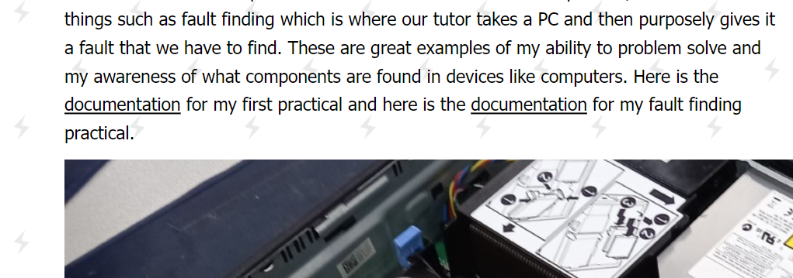
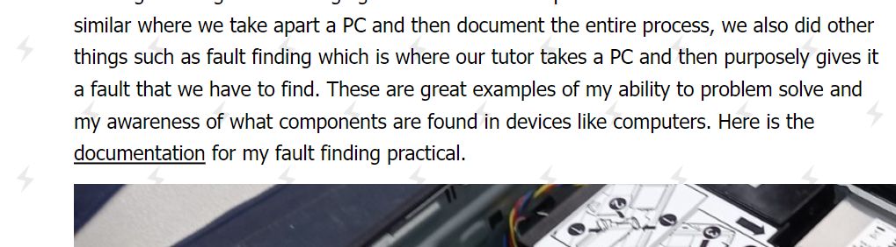
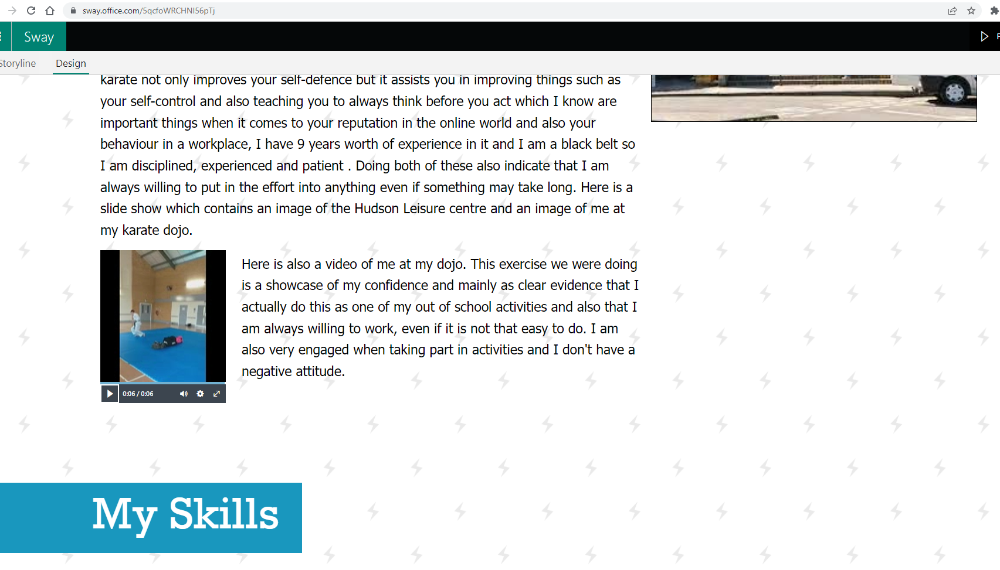
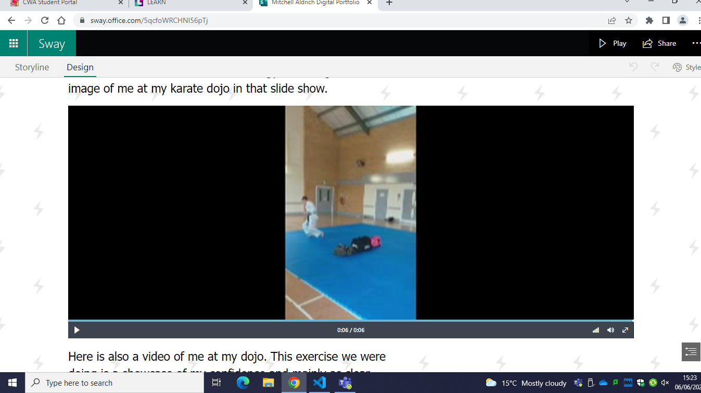
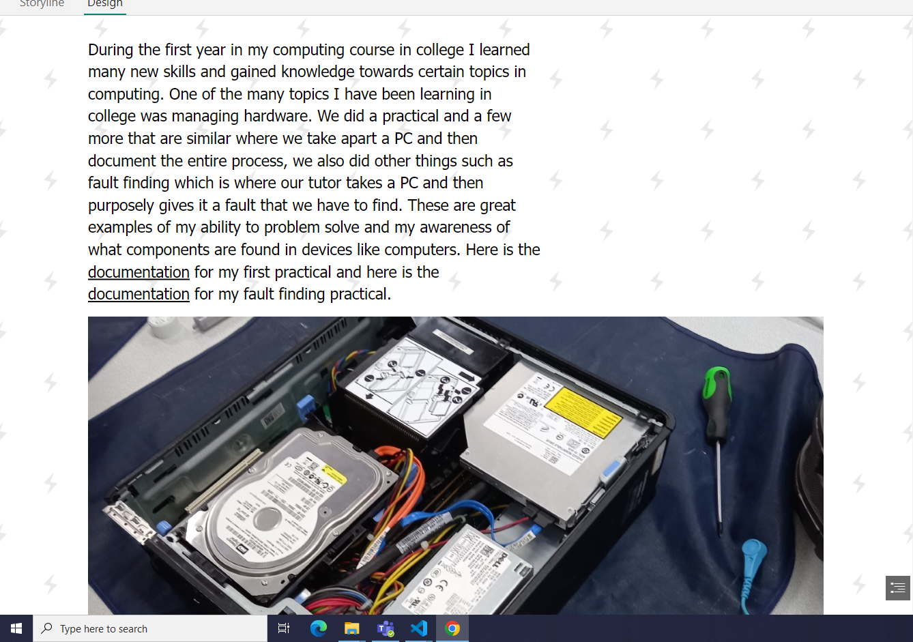
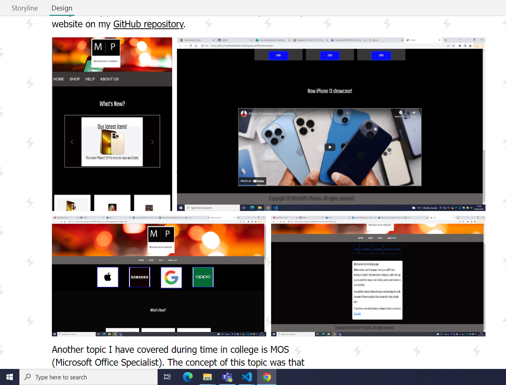
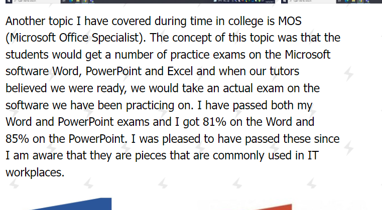
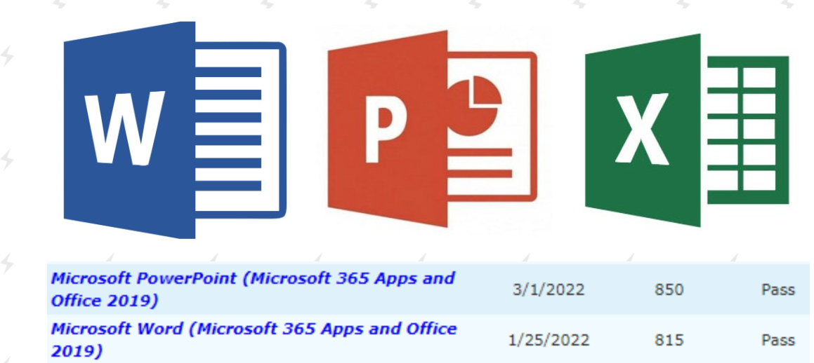

# Testing 

## 1st testing

For the first testing which was just me testing my portfolio on a different system and web browser, I believed that it is good enough to recieve feedback from others. It wasn't a suprise that it would work on different systems since I created the portfolio on Microsoft Sway and Sway is an online software and not a standalone software. It also does work on different browsers such as Google Chrome and Microsoft Edge and it works as it should. However, before I ask for feedback on my portfolio, there are certain little features I would like to add to my portfolio such as a hyperlink to my first ever practical in college in the 'My College' section.

## Added features

I did end up adding that hyperlink before I asked for feedbcak on my portfolio and here is an image of it after and before it was added.

## Here is the aftermath

## This is before the addition

After I believed that my portfolio was suitable enough to get feedback, I did a test demonstration with my tutor Ashley Oliver. After going through my portfolio, he had two main points in the portfolio that I also believed that I should improve upon. 

## 1st improvement 

The first piece of feedback that I received was that I should 'proofread' my portfolio. We understood why this slight issue may have occurred which is because Microsoft sways autocorrect feature will not use autocorrect if the spelling is correct, but even if it is wrong in the context, it would still see it as correct. This will be a simple fix just with some proofreading and correcting the grammar. It is important to proofread my portfolio since the point of your portfolio is to showcase your ability and skills, having spelling mistakes and poor grammar will not impress the audience, especially potential employers.  

## 2nd improvement 

The second piece of feedback that I received was Ashley recommending that I 'sharpen the statements about what the evidence on my portfolio proves'. I need to make more statements on the information about the evidence that would be more relevant and interesting to employers. Yet again this will be a simple fix just by me rewording some of the text where this is the case. I totally agreed with this feedback since I am aware that a portfolio must include the most relevant information possible to set apart my application from other people that are applying for the same job. 

# Student feedback

After I received feedback from Ashley, I then decided to get feedback from one of the other students in my class. Here are the comments made by students on my portfolio. 

# Student comments

#### Aiden
The font and colour scheme are great to view, there is a constant flow of images to support statements and all sorts. It is nicely designed and there is nothing at all wrong with it as far as I can see.

#### Adam 
The font and colour of your portfolio is very good to look at, the images on your portfolio are very helpful when it comes to backing up your claims. It is very well designed and there is nothing i would add personally.

### Patryk
The style you've chosen fits with the images & write up/description of your portfolio. It's really cool that you put a recent clip of your karate dojo & your achievements. Personally, I wouldn't add anything else because it's good.

### Luke
I like the colour scheme you have chosen and I like yours portfolio's layout it is clean and professional. I like the use of text and videos and the way they clearly state your skills and experience.

### Ash 
It looks very good because of the colour scheme and the pictures and you have a lot of nice information about yourself which is really cool.
imorovements: the video could be better so the portfolio would look like something more professional.

## My thoughts on the feedback

Judging by the comments, my portfolio seems that it would easily meet the target audiences needs, there are a variety of positive comments towards the design, colour scheme and description which is helpful that they have mentioned that because I know now those features are not the ones I need to focus on improving. There is one improvement I was provided with by Ash, he stated that the video could be better in terms of quality to make it look more professional. I agree with this statement because I know that this was recorded on a phone, so the video shouldn't really be at a large size. To get the video to look the highest quality I can get it I have to reduce the size to the subtle emphasis setting on my Sway so it is at a size where it won't look distorted and it isn't too small up to the point where it would be barely visible. Here is my result.

 

Further explanation between this and the original will be included further down in the review. 

# Refined content and reasoning

These are the features of my portfolio that I have changed after receiving the feedback from Ashley and the other students. 

## 1st refined content

Firstly, after recieving the feedback from Ashley, I agreed to make some changes to my statements which are used to explain what my assets prove and how they are relevant for being employed in an IT job. I agreed to make this change because I knew how making my statemnts as sharp as possible is important in trying to convince employers how the past achievements I am talking about are relevant and how they will help to be successful in an IT workplace.

## 2nd refined content

After the feedback from Ashley where he made me aware of the grammar errors, I just simply did some proofreading through my portfolio to make sure that I haven't made any more grammar errors whilst correcting the ones that Ashley pointed out. I agreed that it is important to make this change to my portfolio because having poor grammar will be terrible at convincing employers that I put in effort since because it shows that I haven't done any proofreading. Having great grammar however, can convince employers that I have put in the effort into my portfolio and that I clearly care about getting employed. 

# Review 

After making my digital portfolio I must say that I am quite satisfied with the final design, I believe that it meets the target audience requirements since it has a large variety of relevant information and reasonable statements for why they are relevant. I believe my navigation is successful in achieving the purpose of meeting the audiences needs because it is simple and starightfoward, this can convince employers that I like to keep my work organised because it saves them the time of having to try and navigate through a complex navigation system. My chosen color scheme I believe is very IT related, it is a commonly used color scheme in the online world. Overall the portfolio is very organised and professional and reflects does reflect me when I am doing my work at my best. 

## This design and the original 

The final design does have a few changes to the original design, but you can see the comparison because the layout is still similar. This is because most of the changes that I have made to my portfolio are not the sort of changes that will make a huge change to the layout, they were more minor changes such as grammar and making my statements much sharper. The biggest difference between the final design and the original is the addition of the video that I added and the addition of the MOS exams description. Ashely's feedback on my grammar was extremely useful since I will need perfect grammar because the portfolio's purpose is to display my ability and having poor grammar is not going to help display that, my final design obviously has corrected grammar which is another reason it gives it the edge over the original. 

# Changes made

Here are the changes that I have made to my portfolio from when I did my first testing and feedback to now. 

## 1st Change

Eventually, I decided to make a change to my portfolio which I thought was a great idea. I added a video onto the 'My hobbies' section of me at my karate dojo. The main purpose of this video is to add a bit of variety into my portfolio, like Lisa mentioned to me in my storyboard feedback, stuff like this highlights that I have put some thought into my portfolio which is the sort of thing that convinces employers that I am interested in getting an IT related job. This was added right after Ashley's feedback and just before I asked for feedback from other students, hence why some of the comments include an improvement about a video.

Like I mentioned above in the student feedback, I ended up changing the size of the video to make the quality slightly better because it was recorded on a phone which means having it a large size would make the quality not as good. Even though they both achieve the purpose of being evidence Including content like this gives the updated version the edge over the original because evidence like this video supports my statements on the topic it is based on which will convince an employer that I actually possess the skills that these activities that I have taken part in offer. Here is an image of the video before and after the size of it was changed by me to improve the quality. 

## After change

 

## Before change

 

## 2nd change

After all of the feedback that I recieved there was a featutre I did add which was my idea. I eventually added some explanation about my MOS exams and also a screenshot of some of my scores as evidence and three images of the Word, PowerPoint and Excel logos which are just for design. 

Here are two screenshots, one being the added MOS exam explanation and one being the added images of my MOS exam results and the Microsoft software logos, both of these are found at the bottom of the 'My College' section. I chose to add this because it is relevant information for employers since these pieces of software are common in IT workplaces and displaying my knowledge of them on my portfolio can really help in convincing employers that I am worth the attention. It's obvious this makes the portfolio better than what is was like originally becuase this is juts extra information that will have a great likelyhood of convincing employers that you are worth their attention. Here are also images of the explanation and images of my practical work and website which were the only pieces of content in the 'My College' section before the addition of my MOS exams. 

## 'My College' scetion content

 

 

## Added MOS images and explanation to 'My College' section 

 

Since these images are new additions to my portfolio, here is an asset table of where I have got them from since the logos may be subjects to copyright. 

| Source  | Image  | Copyright  | size  | 
|---|---|---|---|
| https://www.pinterest.co.uk/pin/801077852464755063/  | Word logo  | Yes  | 768 x 735  |  
| https://uk.pcmag.com/office-suites/2318/microsoft-powerpoint-2016  | PowerPoint logo  | Yes  | 800 x 780 |  
| https://www.seekpng.com/ipng/u2e6e6a9r5q8r5r5_program-descriptions-my-analytics-guy-microsoft-excel-logo/ | Excel logo | Yes | 820 x 516 |

## Future improvements 

If I had to make any improvements to my portfolio, I would probably add new features such as audio, mainly to add some variety in my portfolio, it could be anything like someones positive comment on me as a person or feedback on work that I have done etc. I could probably add an improved video of the one that is already on my digital portfolio, this is because it isn't that long and the quality of the video could be much better, but even though the current video has these disadvantages, it does achieve the purpose of showing that I actually do karate and right now it is enough, eventually it could be much better. In future, I would also probably add some results for my Excel MOS exam if I do end passing it, this would be great at convincing employers that I have knowledge on using spreadsheet software. 

 