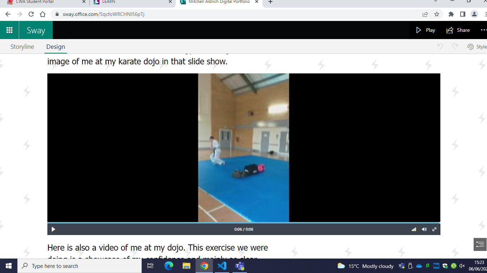

# Testing and feedback 

After I believed that my portfolio was suitable enough to get feedback, I did a test demonstration with my tutor Ashley Oliver. After going through my portfolio, he had two main points in the portfolio that I also believed that I should improve upon. 

## 1st improvement 

The first piece of feedback that I received was that I should 'proofread' my portfolio. We understood why this slight issue may have occurred which is because Microsoft sways autocorrect feature will not use autocorrect if the spelling is correct, but even if it is wrong in the context, it would still see it as correct. This will be a simple fix just with some proofreading and correcting the grammar. It is important to proofread my portfolio since the point of your portfolio is to showcase your ability and skills, having spelling mistakes and poor grammar will not impress the audience, especially potential employers.  

## 2nd improvement 

The second piece of feedback that I received was Ashley recommending that I 'sharpen the statements about what the evidence on my portfolio proves'. I need to make more statements on the information about the evidence that would be more relevant and interesting to employers. Yet again this will be a simple fix just by me rewording some of the text where this is the case. I totally agreed with this feedback since I am aware that a portfolio must include the most relevant information possible to set apart my application from other people that are applying for the same job. 

# Second feedback 

After I received feedback from Ashley, I then decided to get feedback from one of the other students in my class. The student that gave me feedback was Patryk Milasevski. After going through the portfolio with him he also had two main improvements that he had in mind.  

## 1st improvement  

The first piece of feedback that I received from Patryk was for me to 'write about MOS (Microsoft Office Specialist)'. Including information about my exams on the Microsoft Office Specialist I believe is not important at this time since I have not finished all of them yet. If I had finished all of them however, I would include this on my portfolio. 

## 2nd improvement 

The second piece of feedback that I received from Patryk is that he said I should include 'what you want to do in future'. Personally, I disagree that I should include this because I personally do not believe that it is relevant for gaining the attention of an IT job employer. My portfolio is used more for displaying my skills and past achievements instead of sharing my intentions.  

# What I changed 

These are the features of my portfolio that I have changed after receiving the feedback.  

## 1st change 

The first thing that I changed was the statements on my portfolio. As Ashley mentioned I made them sharper, I improved the explanation for why the images on the portfolio are relevant. I just did some more proofreading after this change to make sure that all my grammar was correct.  

## 2nd change  

fter the feedback about some of the grammar, I just simply reworded all the grammar errors that Ashley pointed out whilst testing the digital portfolio. Whilst proofreading throughout the entire portfolio, I did not find any more spelling or grammar errors. 

## 3rd change 

Eventually, after the received feedback I decided to make a change to my portfolio that I thought was a great idea. I added a video onto the 'My hobbies' section of me at my karate dojo. The main purpose of this video is to add a bit of variety into my portfolio, like Lisa mentioned to me in my storyboard feedback, stuff like this highlights that I have put some thought into my portfolio.  

 

# Review 

After making my digital portfolio I must say that I am quite satisfied with the final design, I believe that it meets the target audience requirements since it has a large variety of relevant information and reasonable statements for why they are relevant. My navigation is very straightforward since no employer wants to spend most of their time struggling to navigate through a complex navigation system. My chosen color scheme I believe is very IT related, it is a commonly used color scheme in the online world.  

## This design and the original 

The final design does have a few changes to the original design, but you can see the comparison because the layout is still similar. This is because most of the changes that I have made to my portfolio are not the sort of changes that will make a huge change to the layout, they were more minor changes such as grammar and making my statements much sharper. The biggest difference between the final design and the original is the addition of the video that I added. Ashely's feedback on my grammar was extremely useful since I will need perfect grammar because the portfolio's purpose is to display my ability and having poor grammar is not going to help display that, my final design obviously has corrected grammar which is another reason it gives it the edge over the original.  

## Future improvements 

If I had to make any improvements to my portfolio, I would add some information about MOS if I were able to finish the last exam, I have which is on Excel. If I had the chance, I would add other assets in the form of different contents such as videos, audio, programs, or systems, this is to just add a bit of variety into my portfolio and to simply make it more appealing towards potential IT employers. 

 